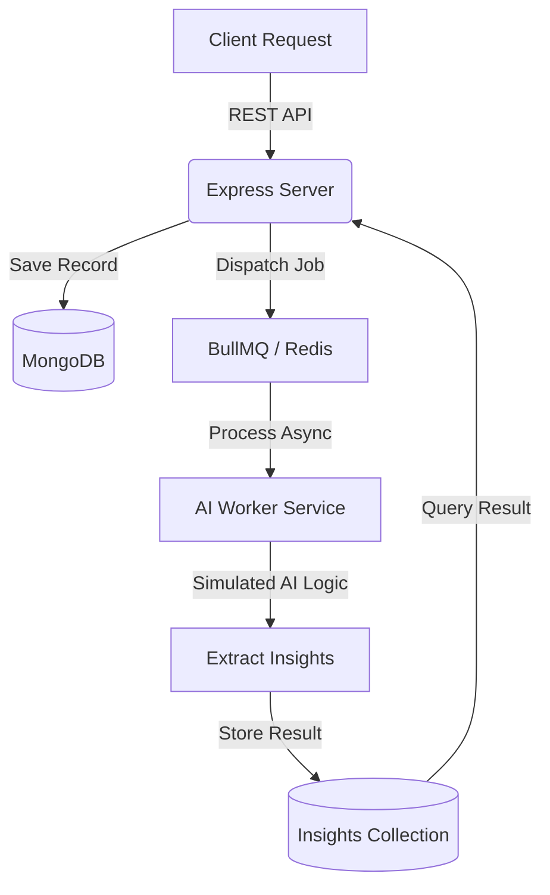

# Notely 📝

Notely is a professional-grade, high-performance note-taking and workspace management ecosystem. It is designed to bridge the gap between simple text capture and actionable intelligence by leveraging **asynchronous AI background processing**.

---

## 🚀 Key Features

### 👤 Identity & Security

- **JWT Authentication**: Industry-standard stateless authentication.
- **Bcrypt Hashing**: Multi-pass secure password storage.
- **Route Protection**: Granular middleware-based access control.

### 🏢 Organization Logic

- **Workspaces**: High-level containers for different domains of your life (e.g., "Work", "Personal").
- **Projects**: Sub-containers within workspaces to group related notes and tasks.
- **Deep Nesting**: Clean hierarchical structure: `User -> Workspace -> Project -> Note`.

### 🧠 AI Intelligence (Asynchronous)

Each note you save is automatically analyzed by our background intelligence layer to extract:

- **Sentiment Analysis**: Detecting user mood and feedback tone.
- **Pain Point Identification**: Finding friction in user descriptions.
- **Feature Requests**: Distilling "wants" from natural language.
- **Strategic Solutions**: AI-suggested next steps based on content.

---

## 🏗️ System Architecture

Our architecture is designed for **maximum non-blocking performance**. The main API thread never waits for AI processing.



---

## 📂 Detailed Repository Structure

Below is a comprehensive map of the codebase to help you navigate the logic layers.

```text
Notely/
├── .agent/                     # AI Agency & Automation Layer
│   └── workflows/              # Custom agent skills (test-module, auto-comment)
├── backend/                    # Core Server Application
│   ├── src/                    # Source Code
│   │   ├── core/               # Cross-cutting concerns & infrastructure
│   │   │   ├── config/         # Connectivity & Environment logic
│   │   │   │   ├── db.js       # MongoDB/Mongoose connection setup
│   │   │   │   ├── redis.js    # Shared Redis connection & retry strategy
│   │   │   │   └── env.js      # Centralized environment variable management
│   │   │   ├── middleware/     # Request lifecycle hooks
│   │   │   │   └── auth.middleware.js # JWT verification & User injection
│   │   │   └── utils/          # Generic helper functions
│   │   ├── modules/            # Domain-Driven Modules (Encapsulated Logic)
│   │   │   ├── auth/           # User Identity & Security module
│   │   │   ├── workspace/      # Top-level organization containers
│   │   │   ├── project/        # Nested project management
│   │   │   ├── notes/          # Note capture & triggering analysis jobs
│   │   │   └── insight/        # AI Result retrieval & management
│   │   │       ├── insight.model.js  # Schema for AI findings
│   │   │       ├── insight.service.js # Business logic for insights
│   │   │       ├── insight.controller.js # Request handlers
│   │   │       └── insight.router.js # Endpoint definitions
│   │   ├── queues/             # BullMQ Queue definitions
│   │   │   └── ai.queue.js     # Definition of the "ai-analysis" queue
│   │   ├── workers/            # Background CPU-heavy task processors
│   │   │   └── ai.workers.js   # The worker picking up notes for analysis
│   │   ├── jobs/               # Unit-of-work dispatchers
│   │   │   └── analyzeNote.job.js # Logic to package data into a queue job
│   │   └── server.js           # Express instance & route registration
│   ├── tests/                  # Automated validation suites
│   ├── .env                    # System secrets (Port, Mongo, JWT, Redis)
│   └── package.json            # NPM configuration & dependencies
└── README.md                   # System Blueprint
```

---

## 🛠️ Technology Stack

- **Server-Side**: Node.js & Express.js (v18+)
- **Database**: MongoDB (Mongoose Schema-driven)
- **Background Engine**: BullMQ
- **State/Queue Memory**: Redis
- **Security**: jsonwebtoken, bcryptjs

---

## 📖 API Documentation

### Authentication

| Endpoint             | Method | Description                  | Auth Required |
| :------------------- | :----- | :--------------------------- | :------------ |
| `/api/auth/register` | `POST` | Create a new account         | No            |
| `/api/auth/login`    | `POST` | Authenticate and receive JWT | No            |

### Workspaces

| Endpoint             | Method   | Description              | Auth Required |
| :------------------- | :------- | :----------------------- | :------------ |
| `/api/workspace`     | `POST`   | Create a new workspace   | Yes           |
| `/api/workspace`     | `GET`    | List all user workspaces | Yes           |
| `/api/workspace/:id` | `DELETE` | Remove a workspace       | Yes           |

### Projects

| Endpoint       | Method | Description                    | Auth Required |
| :------------- | :----- | :----------------------------- | :------------ |
| `/api/project` | `POST` | Create project under Workspace | Yes           |
| `/api/project` | `GET`  | Filter projects by Workspace   | Yes           |

### Notes & Insights

| Endpoint       | Method | Description                       | Auth Required |
| :------------- | :----- | :-------------------------------- | :------------ |
| `/api/note`    | `POST` | Create Note (Triggers AI)         | Yes           |
| `/api/note`    | `GET`  | Paginated fetching (Cursor-based) | Yes           |
| `/api/insight` | `GET`  | View AI-generated findings        | Yes           |

---

## ⚙️ Development Setup

### 1. Prerequisites

Ensure you have **MongoDB** and **Redis** running.

- **Redis Utility**: `redis-server` (Standard port 6379)
- **DB Utility**: `mongod`

### 2. Environment Variables

Create `/backend/.env`:

```bash
PORT=5001
MONGO_URI=mongodb://localhost:27017/notely
JWT_SECRET=super_secret_string
REDIS_HOST=127.0.0.1
REDIS_PORT=6379
```

### 3. Boot Commands

```bash
npm install
npm run dev
```

---

## 🛠️ Troubleshooting

**Redis Connection Refused**:
If you see `ECONNREFUSED` in the console, it means the background workers cannot connect to Redis.

- **Solution**: Run `redis-server` in a separate terminal. Note that the application will still handle API requests, but AI Insights will be paused until Redis is connected.

**Note Creation Fails**:
Ensure you are passing a valid `workspace` and `project` ObjectID in the request body.

---

_Created for learning_
